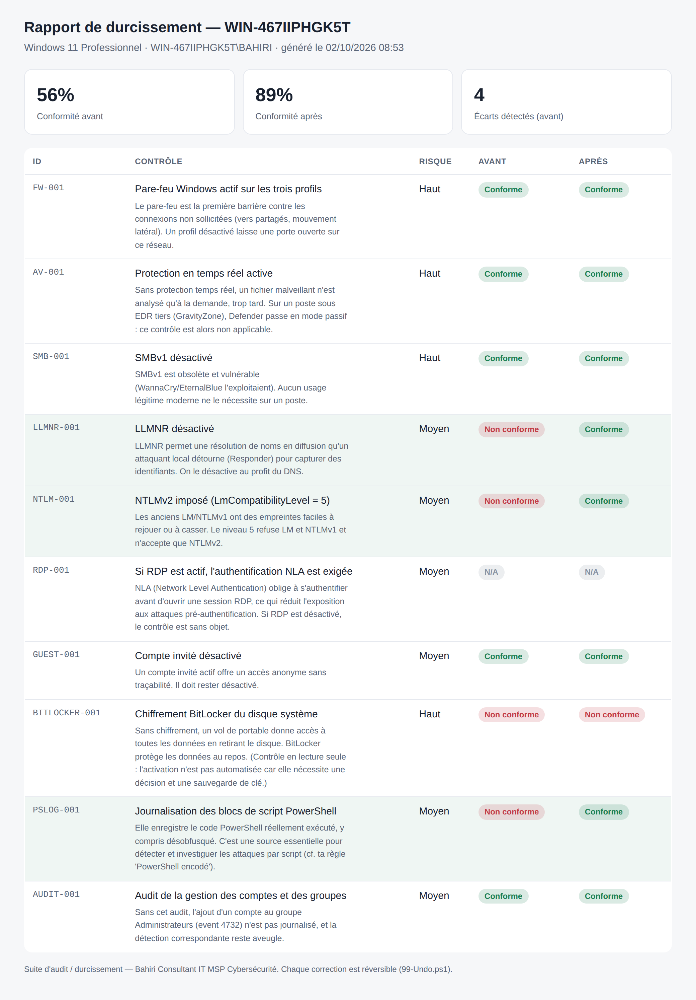
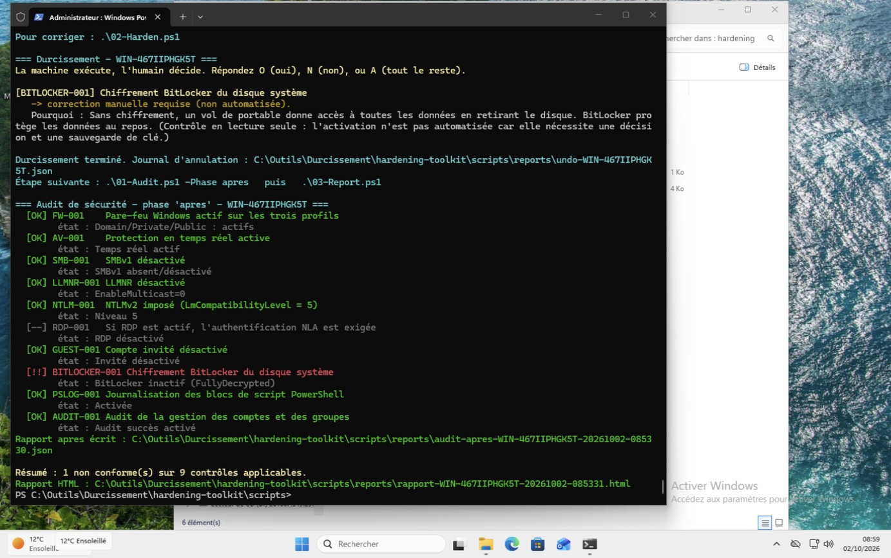

# Suite d'audit et de durcissement — poste Windows

Outil défensif pour TPE/PME : auditer la configuration de sécurité d'un poste Windows,
le durcir **avec validation humaine**, et produire un rapport **avant / après** partageable.

> Principe directeur : **la machine exécute, l'humain décide.** Aucune modification sans accord,
> le *pourquoi* est affiché avant chaque correction, et tout est réversible.

## Aperçu

Rapport avant / après généré par l'outil (score passé de 56 % à 89 % de conformité) :



Exécution dans PowerShell (audit, durcissement avec validation, re-audit) :



## Interface

Ouvrez `ui/index.html` dans un navigateur. La page présente la séquence dans l'ordre,
l'utilité de chaque script, où le placer, et la commande à copier. Elle sait aussi
afficher un rapport JSON (glisser-déposer depuis `reports\`).

## Séquence (ordre logique)

| Ordre | Script | Rôle | Agit ? |
|---|---|---|---|
| 1 | `00-Simulate-Benign.ps1` | Génère des événements inoffensifs et réversibles pour vérifier que la **détection** fonctionne (lab) | Réversible |
| 2 | `01-Audit.ps1` | **Photographie** l'état de sécurité initial → rapport `avant` | Lecture seule |
| 3 | `02-Harden.ps1` | **Durcit** chaque écart, après avoir expliqué le pourquoi et demandé O/N | Modifie (réversible) |
| 4 | `01-Audit.ps1 -Phase apres` | Re-photographie après durcissement → rapport `après` | Lecture seule |
| 5 | `03-Report.ps1` | Produit le **rapport HTML avant / après** et l'ouvre | Lecture seule |
| 6 | `99-Undo.ps1` | **Annule** les corrections (ordre inverse) à partir du journal | Réversible |

## Où placer les fichiers sur le poste

```
C:\Outils\Durcissement\
├─ ui\index.html              ← ouvrir pour piloter la séquence
├─ scripts\
│  ├─ lib\Common.ps1          ← bibliothèque (journal, rapports)
│  ├─ lib\Controls.ps1        ← catalogue des contrôles (le pourquoi/comment)
│  ├─ 00-Simulate-Benign.ps1
│  ├─ 01-Audit.ps1
│  ├─ 02-Harden.ps1
│  ├─ 03-Report.ps1
│  └─ 99-Undo.ps1
└─ reports\                   ← rapports JSON + HTML + journal d'annulation (créé au 1er lancement)
```

## Démarrage rapide

```powershell
# Terminal PowerShell en ADMINISTRATEUR, dans le dossier scripts\
Set-ExecutionPolicy -Scope Process Bypass -Force

.\01-Audit.ps1                 # état avant
.\02-Harden.ps1                # durcissement interactif (O / N / A)
.\01-Audit.ps1 -Phase apres    # état après
.\03-Report.ps1                # rapport avant / après (HTML)
```

Pour revenir en arrière : `.\99-Undo.ps1`.

## Contrôles couverts

Pare-feu (3 profils) · protection temps réel (Defender, ou N/A si EDR tiers comme GravityZone) ·
SMBv1 · LLMNR · NTLMv2 (LmCompatibilityLevel) · RDP/NLA · compte invité · BitLocker (lecture seule) ·
journalisation des blocs de script PowerShell · audit de la gestion des comptes.

Le catalogue est dans `scripts/lib/Controls.ps1` : un contrôle = un objet autonome
(id, titre, pourquoi, risque, vérification, correction, annulation). Pour en ajouter un,
copiez un bloc existant.

## Précautions

- Testez d'abord sur la **VM de lab**, jamais directement sur un poste client.
- `02-Harden.ps1 -WhatIf` montre ce qui serait fait sans rien changer.
- BitLocker n'est volontairement **pas** activé automatiquement : l'activation exige une décision
  et une sauvegarde de la clé de récupération.
- Certaines corrections (SMBv1, NTLM) peuvent demander un **redémarrage** pour être pleinement effectives.
